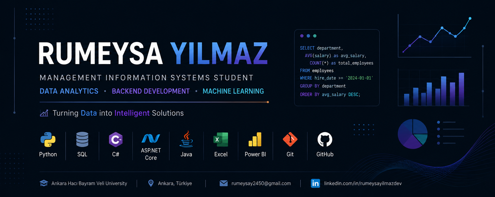

  

<h1 align="center">Hi 👋 I'm Rumeysa Yılmaz</h1>

<h3 align="center">
Management Information Systems Student • Data Analytics • Backend Development • Machine Learning
</h3>

  

  
  
  
  

---

## 👩‍💻 About Me

I am a Management Information Systems student at Ankara Hacı Bayram Veli University with an interest in data analytics, backend development and machine learning.

I enjoy working with data, building dashboards, analyzing patterns and developing practical software solutions. My goal is to improve myself in data analysis, database management and software development while creating useful real-world projects.

- 🎓 Management Information Systems Student  
- 📍 Ankara, Türkiye  
- 📊 Interested in Data Analytics and Business Intelligence  
- 💻 Also improving myself in Backend Development  
- 🤖 Exploring Machine Learning and Data-Driven Solutions  
- 🇬🇧 English Level: B2  

---

## 🛠️ Tech Stack

### 📊 Data Analytics & Machine Learning

  
  
  
  
  
  
  

### 💻 Software Development

  

### 🧰 Tools

  
  

---

## 📌 Featured Projects

### 📊 Student Performance Analysis Dashboard
An Excel-based dashboard project created to analyze student performance through charts, KPIs and visual reports.

**Focus:** Data Analysis • Dashboard Design • Excel Reporting

---

### 🤖 Machine Learning Classification Project
A classification project developed with Python, including data preprocessing, model training and performance evaluation.

**Focus:** Python • Machine Learning • Model Evaluation

---

### 📋 Task Planning & Tracking System
A web-based task tracking project designed to organize tasks, monitor progress and improve productivity.

**Focus:** Web Development • Task Management • User Interface

---

### 📚 Library Management System
An Android-based library management application developed for managing books, users and borrowing operations.

**Focus:** Android Development • Java • SQLite

---

## 📈 GitHub Stats

  
  

  

---

## 🌱 Currently Learning

- Advanced SQL queries  
- Power BI dashboards  
- Data visualization techniques  
- Python for data analysis  
- ASP.NET Core backend development  
- Git & GitHub portfolio management  

---

## 🎯 Career Interests

- Data Analyst  
- Business Intelligence  
- Backend Development  
- Machine Learning  
- Database Management  

---

## 📫 Connect With Me

  

  

---

  <b>Turning Data into Intelligent Solutions ✨</b>

